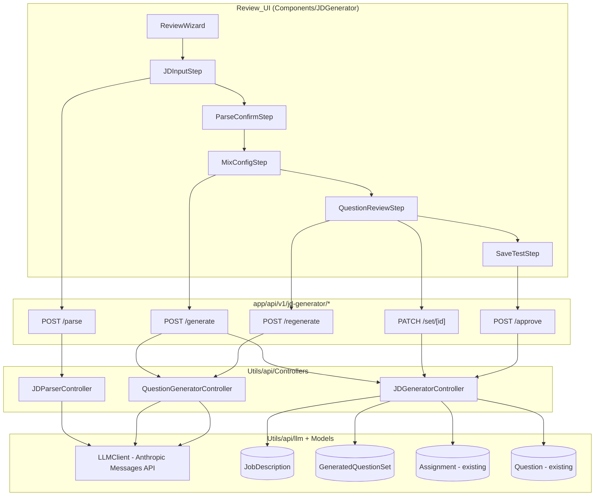

# Design Document: JD Question Generator

## Overview

The JD Question Generator (`JD_Generator`) is a subsystem available to all authenticated users that turns a raw job description into an editable set of assessment questions and, on explicit approval, into a reusable Test in ProfilizePro's existing test-attempt flow. Login is required so that anonymous visitors cannot consume LLM resources, but access does not depend on the admin role.

The flow is a four-stage wizard backed by a small set of API routes:

1. **Input** — an authenticated user pastes JD text or uploads a `.txt`/`.pdf`/`.docx` file. The text is length-validated.
2. **Parse (Stage 1)** — `JD_Parser` calls the `LLM_Client` once to extract `role`, `seniority`, `skills`, `mustHave`, and `niceToHave`. The user confirms and edits the result.
3. **Generate (Stage 2)** — `Question_Generator` calls the `LLM_Client` with the confirmed signal, a requested `Mix`, a target difficulty, and optional preferred languages, then validates the output against a schema and persists a `Job_Description` plus a `Generated_Question_Set` with provenance.
4. **Review & Save** — the user reviews, edits, deletes, adds, or regenerates individual questions, then approves the set, which is mapped into the existing `Assignment` + `Question` documents that the test-attempt flow already consumes.

Nothing is published as a Test until the user explicitly approves it. Every generated set records provenance (`{ jdHash, model, promptVersion }`) so generated content stays auditable.

### Key Design Decisions

- **"Test" maps to the existing `Assignment` + `Question` documents.** ProfilizePro has no standalone `Test` model; the test-attempt flow loads an `Assignment` document and the `Question` documents that reference it via `AssignmentId`. "Save approved set as a Test" therefore means: create one `Assignment` and one `Question` document per approved `Generated_Question`. This satisfies the requirement that the Test be usable "without a separate code path" (Req 9.5).
- **Staging is separate from the live Test.** `Job_Description` and `Generated_Question_Set` are new staging collections. They hold the editable, not-yet-published work. The live `Assignment`/`Question` documents are only created on approval. This enforces "no publish until approval" (Req 7.5) by construction.
- **`LLM_Client` is a thin, provider-isolated wrapper.** The requirements specify the Anthropic Messages API. The existing AI controllers (`GenerateTestController`, `SuggestSubtopicsController`) currently call Google Gemini through the Vercel AI SDK. This design introduces a dedicated `LLM_Client` wrapper as the single integration point so the provider choice is isolated behind a typed interface; see the note in Architecture. The wrapper reuses the established conventions from those controllers: Zod validation, markdown-fence stripping, and bounded retries.
- **Additive, backward-compatible `Question` schema fields.** The existing `Question` schema is MCQ-shaped. To carry coding test cases and the originating `skillTag` without breaking the test-attempt flow, the mapping adds optional fields (`kind`, `skillTag`, `testCases`) to the `Question` schema. Existing consumers ignore unknown optional fields; Mongoose strict mode requires the fields to exist on the schema, so they are declared as optional.

> **Open design note (needs confirmation):** Requirements and the task brief name the **Anthropic Messages API**, but the existing code uses **Google Gemini via the Vercel AI SDK**. This design treats Anthropic as the target per the requirements glossary and isolates it behind `LLM_Client`. If the project intends to standardize on Gemini, only the wrapper implementation changes — no other component is affected.

## Architecture



### Request authorization

Every route guards with `getAuthUser()` from `@/Utils/api/auth` as its first statement, mirroring the `generate-test` / `submit-test` route pattern (`auth.ts` exposes `getAuthUser()`, which resolves the JWT from the `Authorization` header or `token` cookie and returns the user or `null`, never throwing; the requirements reference this as the `getAuthUser`/`requireAuth` pattern). When `getAuthUser()` returns `null` (no or invalid session) the caller receives `401` and the handler returns **before** any `LLM_Client` call or DB write. Access depends only on being authenticated — there is no admin-role check and no `403` path. This guarantees Req 1.1 (no LLM spend for unauthenticated callers) at the route boundary.

### Two-stage LLM pipeline

- **Stage 1 (`JD_Parser`)** is one `LLM_Client` call that extracts structured hiring signal. Its output is validated by a Zod schema (`ParsedSignalSchema`). On invalid JSON the parser retries exactly once with a stricter JSON-only instruction, then fails with `400`.
- **Stage 2 (`Question_Generator`)** is one `LLM_Client` call that produces the question set from the *confirmed* signal. Its output is validated by `GeneratedSetSchema`, with the same single-retry-then-fail policy. Single-question regeneration reuses the same generator with a prompt scoped to one slot.

### Layering

The feature follows the established layering: thin route handlers (`app/api/v1/jd-generator/*`) → controllers (`Utils/api/Controllers/*`) → models (`Utils/api/Models/*`) and the shared `LLM_Client` (`Utils/api/llm/*`). Client API wrappers live in `Utils/Apicalls/JDGenerator.ts`; shared types in `Utils/types/JDGenerator.ts`; Zod schemas in `Utils/validation/jdGeneratorSchemas.ts`; UI in `Components/JDGenerator/`.

## Components and Interfaces

### API Routes (`app/api/v1/jd-generator/`)

| Route | Method | Purpose | Requirements |
|---|---|---|---|
| `/parse/route.ts` | `POST` | Validate JD input, run Stage 1, return parsed signal + `jobDescriptionId` | 2.x, 3.x |
| `/generate/route.ts` | `POST` | Run Stage 2 from a confirmed signal, persist staging docs, return set + shortfall | 4.5, 5.x, 6.x |
| `/set/[id]/route.ts` | `PATCH` | Apply review edits/deletes/adds to a `Generated_Question_Set` | 7.2, 7.3, 7.4 |
| `/regenerate/route.ts` | `POST` | Regenerate a single question by index (cooldown-gated) | 8.x |
| `/approve/route.ts` | `POST` | Map an approved set into an `Assignment` + `Question` documents | 9.x |

All routes: `getAuthUser()` guard first (returns `null` → `401`, before any `LLM_Client` call or DB write), then `connectdb()`, then body parse, then delegate to a controller, returning `NextResponse.json`. The creating user identity always comes from the JWT (`user.email` / `user.userId`), never from the body.

#### `POST /parse`

- **Paste path:** `Content-Type: application/json` → `{ text: string }`.
- **Upload path:** `multipart/form-data` → a file field plus optional `text`.
- Behavior: extract text (paste vs upload), enforce `Minimum_JD_Length` (50 words), call `JD_Parser`. Returns `{ jobDescriptionId, parsed }` or a typed error (`unsupported_file`, `too_short`, `parse_failed`, `not_a_job_description`).

#### `POST /generate`

Body: `{ jobDescriptionId, confirmedSignal, mix, difficulty, preferredLanguages? }`. Returns `{ generatedQuestionSetId, questions, shortfall }`.

#### `PATCH /set/[id]`

Body is a discriminated union: `{ op: "edit", index, question }`, `{ op: "delete", index }`, or `{ op: "add", question }`. Returns the updated set.

#### `POST /regenerate`

Body: `{ generatedQuestionSetId, index }`. Cooldown-checked against `lastRegenerationAt`. Returns the updated set or a `rate_limited` error.

#### `POST /approve`

Body: `{ generatedQuestionSetId, title, duration, passingScore }`. Validates `passingScore ∈ [0, 100]`, maps questions, creates the `Assignment` + `Question` documents, records `testId` on the set, returns `{ testId }`.

### Controllers (`Utils/api/Controllers/`)

```typescript
// JDParserController.ts
export const parseJD = async (
  rawText: string,
  sourceType: "paste" | "upload",
  userId: string,
): Promise<
  | { ok: true; jobDescriptionId: string; parsed: ParsedSignal }
  | { ok: false; error: "too_short" | "parse_failed" | "not_a_job_description" }
>;

// QuestionGeneratorController.ts
export const generateQuestionSet = async (
  input: GenerationInput,   // confirmed signal + mix + difficulty + languages
  userId: string,
): Promise<
  | { ok: true; set: GeneratedQuestionSetDoc; shortfall: Mix }
  | { ok: false; error: "generation_failed" }
>;

export const regenerateQuestion = async (
  setId: string,
  index: number,
  userId: string,
): Promise<
  | { ok: true; set: GeneratedQuestionSetDoc }
  | { ok: false; error: "rate_limited" | "not_found" | "bad_index" }
>;

// JDGeneratorController.ts
export const editQuestion   = async (setId: string, index: number, q: GeneratedQuestion) => /* ... */;
export const deleteQuestion = async (setId: string, index: number) => /* ... */;
export const addQuestion    = async (setId: string, q: GeneratedQuestion) => /* ... */;
export const approveAsTest  = async (setId: string, meta: ApproveMeta, userId: string) =>
  // validates passingScore, maps to Assignment + Question[], records testId
  Promise<{ ok: true; testId: string } | { ok: false; error: "invalid_score" | "not_found" }>;
```

### LLM Client (`Utils/api/llm/LLMClient.ts`)

A single typed wrapper around the Anthropic Messages API. Responsibilities:

- Issue a Messages request with a configured model and `promptVersion`.
- Enforce a request timeout (`LLM_REQUEST_TIMEOUT_MS`); on expiry return a typed `LLMTimeoutError` rather than blocking (Req 10.3).
- Strip markdown fences and parse JSON (reusing the `GenerateTestController` convention).
- Surface a typed result so callers can apply the single-retry-then-fail policy.

```typescript
export interface LLMResult { text: string; model: string; }
export class LLMTimeoutError extends Error {}

export const callLLM = async (params: {
  system: string;
  user: string;
  timeoutMs?: number;
}): Promise<LLMResult>; // throws LLMTimeoutError on timeout
```

### Client API wrappers (`Utils/Apicalls/JDGenerator.ts`)

`parseJD`, `generateQuestions`, `editQuestion`, `deleteQuestion`, `addQuestion`, `regenerateQuestion`, `approveAsTest` — each a typed `fetch`/`axios` wrapper returning a parsed response, following the `Utils/Apicalls` convention.

### Review UI (`Components/JDGenerator/`)

- `ReviewWizard.tsx` — orchestrates the four steps and holds wizard state.
- `JDInputStep.tsx` — paste textarea + file upload; client-side length hint.
- `ParseConfirmStep.tsx` — editable `role`, `seniority` (select constrained to the enum), and skill chips (add/remove).
- `MixConfigStep.tsx` — counts for `{ mcq, coding, aptitude }`, target difficulty, preferred languages.
- `QuestionReviewStep.tsx` + `QuestionCard.tsx` — questions grouped by kind with difficulty/`skillTag` badges; edit/delete/add/regenerate controls; per-action loading indicators and inline error messages.
- `SaveTestStep.tsx` — title, duration, passing score; approve action.

Page entry: `app/jd-question-generator/page.tsx`, a top-level authenticated page placed alongside the other logged-in-user pages (`app/dashboard`, `app/profile`, `app/explore`). It is **not** admin-gated: it gates client-side by reading the `token` from `localStorage` and redirecting to `/login` when absent, then confirming the session via `getUser()` (mirroring the admin page pattern but **without** the `isAdmin` check). Any authenticated user reaches the wizard. All components use `"use client"`, `FC` typing, the `@/` alias, `useTheme()`, and `Toast` for notifications.

## Data Models

### `Job_Description` (`Utils/api/Models/JobDescription.ts`) — new

```typescript
{
  sourceType: "paste" | "upload",   // required
  rawText: string,                   // required
  jdHash: string,                    // sha256 of normalized rawText
  parsed: {
    role: string,
    seniority: "intern" | "junior" | "mid" | "senior" | "lead",
    skills: string[],
    mustHave: string[],
    niceToHave: string[],
  },
  createdBy: string,                 // user email/id from JWT
  createdAt: Date,
}
```

### `Generated_Question_Set` (`Utils/api/Models/GeneratedQuestionSet.ts`) — new

```typescript
{
  jobDescriptionId: ObjectId,        // ref "JobDescription"
  requestedMix: { mcq: number, coding: number, aptitude: number },
  difficulty: "easy" | "medium" | "hard" | "mixed",
  preferredLanguages: string[],
  questions: GeneratedQuestion[],
  shortfall: { mcq: number, coding: number, aptitude: number },
  generatedFrom: {                   // Provenance
    jdHash: string,
    model: string,
    promptVersion: string,
  },
  createdBy: string,                 // user id from JWT
  testId?: ObjectId,                 // set on approval (ref "Assignment")
  lastRegenerationAt?: Date,         // cooldown anchor
  createdAt: Date,
  updatedAt: Date,
}
```

### `Generated_Question` (embedded subdocument / `Utils/types/JDGenerator.ts`)

```typescript
{
  kind: "mcq" | "coding" | "aptitude",
  text: string,
  options?: string[],                // mcq
  answer?: string,                   // mcq / aptitude
  testCases?: { input: string, expectedOutput: string, hidden: boolean }[], // coding (>=3, >=1 hidden)
  skillTag?: string,                 // mcq/coding: drawn from mustHave ∪ niceToHave
  language?: string,                 // coding
  difficulty: "easy" | "medium" | "hard",
  edited: boolean,                   // set true when a user edits content
  manuallyAdded?: boolean,
}
```

### Existing `Question` schema — additive optional fields

To map coding/aptitude questions while keeping the test-attempt flow intact, add optional fields (declared so Mongoose strict mode retains them):

```typescript
kind?: "mcq" | "coding" | "aptitude",
skillTag?: string,
testCases?: { input: string, expectedOutput: string, hidden: boolean }[],
```

Mapping `Generated_Question` → existing `Question` (on approval):

| Question field | Source |
|---|---|
| `Question` | `text` |
| `AssignmentId` | new `Assignment._id` |
| `type` | `kind` |
| `options` | `options` (mcq) |
| `answer` | `answer` (mcq/aptitude) |
| `marks` | from `ApproveMeta` (default per-kind) |
| `level` | numeric mapping of `difficulty` (easy=1, medium=2, hard=3) |
| `kind` / `skillTag` / `testCases` | carried through (additive) |

The `Assignment` ("Test") is created with `name = title`, `difficulty`, `owner = userId`, and `isCustom = true`, matching the existing creation path so it is immediately attemptable.

## Correctness Properties

*A property is a characteristic or behavior that should hold true across all valid executions of a system — essentially, a formal statement about what the system should do. Properties serve as the bridge between human-readable specifications and machine-verifiable correctness guarantees.*

The following properties were derived from the acceptance criteria via the prework analysis. Authenticated-user gating (1.x), UI rendering/feedback (4.1, 7.1, 10.1, 10.2), LLM-call integration (3.1, 5.1, 6.1, 9.1, 9.5), procedural retry sequences (3.3, 3.4, 5.4, 5.5, 10.3), and LLM-judgement behavior (5.8) are covered by example, edge-case, integration, and smoke tests in the Testing Strategy rather than as universal properties.

### Property 1: JD minimum-length gate

*For any* JD input text, if it contains fewer than `Minimum_JD_Length` (50) words, the input is rejected with a descriptive error and the `LLM_Client` is not invoked; if it contains 50 or more words, it passes the length gate.

**Validates: Requirements 2.5**

### Property 2: Input source typing

*For any* accepted JD submission, the recorded `sourceType` is `paste` when the input comes from pasted text and `upload` when it comes from a supported (`.txt`/`.pdf`/`.docx`) file.

**Validates: Requirements 2.1, 2.2**

### Property 3: Unsupported-upload handling depends on paste presence

*For any* upload whose file type is not `.txt`/`.pdf`/`.docx`: if it is the sole input the submission is rejected with a descriptive error; if it is accompanied by valid pasted text the pasted text is processed and the unsupported upload is ignored.

**Validates: Requirements 2.3, 2.4**

### Property 4: Parser output validation and seniority enum

*For any* candidate `JD_Parser` output object, validation accepts it if and only if it is schema-valid with `seniority` in `{intern, junior, mid, senior, lead}`; an output that fails validation is never returned as a successful parse.

**Validates: Requirements 3.2**

### Property 5: Generation payload composition

*For any* parsed skill set together with a user's removals, additions, and edits, the skill set sent to the `Question_Generator` equals the parsed skills minus the removed skills plus the added skills, and the payload carries the edited `role` and `seniority` values.

**Validates: Requirements 4.2, 4.3, 4.4, 4.5**

### Property 6: Target difficulty enum

*For any* requested target difficulty value, generation accepts it if and only if it is in `{easy, medium, hard, mixed}`.

**Validates: Requirements 5.2**

### Property 7: Generation output validation with no partial persistence

*For any* candidate `Question_Generator` output, the generator returns a set if and only if the output is schema-valid; when validation ultimately fails, no `Generated_Question_Set` is persisted.

**Validates: Requirements 5.3, 5.5**

### Property 8: skillTag membership

*For any* validated `Generated_Question_Set`, every MCQ and coding question has a `skillTag` that belongs to the confirmed `mustHave ∪ niceToHave` skills.

**Validates: Requirements 5.6**

### Property 9: Coding question test-case invariant

*For any* validated `Generated_Question_Set`, every coding question has at least three test cases with at least one marked hidden.

**Validates: Requirements 5.7**

### Property 10: Mix shortfall accounting

*For any* requested `Mix` and the produced question set, the produced count per kind never exceeds the requested count, and the reported `shortfall` for each kind equals the requested count minus the produced count.

**Validates: Requirements 5.9**

### Property 11: Provenance, authorship, and jdHash determinism

*For any* generation performed by user A, both the persisted `Job_Description` and `Generated_Question_Set` record `createdBy == A`, the set's `generatedFrom` is populated with `{ jdHash, model, promptVersion }`, and `jdHash` is a deterministic function of the normalized raw JD text (the same JD text always produces the same hash).

**Validates: Requirements 6.2, 6.4**

### Property 12: Question-set editing operations

*For any* `Generated_Question_Set`: editing the question at a valid index replaces only that question's content, sets its `edited` flag to true, and leaves all other questions unchanged; deleting at a valid index yields a set of length n−1 equal to the original minus that question; adding a question yields a set of length n+1 that contains the new question.

**Validates: Requirements 7.2, 7.3, 7.4**

### Property 13: Single-question regeneration isolation

*For any* `Generated_Question_Set` and valid index i, regenerating the question at index i replaces only the question at i; every other question — including any a user has edited — is left unchanged.

**Validates: Requirements 8.1, 8.2**

### Property 14: Regenerate cooldown

*For any* two regeneration requests on the same set separated by less than `Regenerate_Cooldown`, the second request is rejected with a rate-limit error and the `LLM_Client` is not invoked; requests separated by at least the cooldown are allowed.

**Validates: Requirements 8.3**

### Property 15: Passing-score range validation

*For any* supplied passing score, approval succeeds only if the score is within `[0, 100]`; otherwise approval is rejected with a validation error and no `Assignment` or `Question` documents are created.

**Validates: Requirements 9.2**

### Property 16: Question mapping coverage

*For any* approved `Generated_Question_Set`, the mapper produces exactly one schema-valid `Question` document per `Generated_Question`, preserving the question text, options, answer, and kind, and assigning a valid numeric `level`; the number of `Question` documents equals the number of approved questions.

**Validates: Requirements 9.3**

## Error Handling

All controller results are typed discriminated unions (`{ ok: true, ... } | { ok: false, error }`) so route handlers map outcomes to HTTP status codes without throwing across layers.

| Condition | Where | Response |
|---|---|---|
| No/invalid session | Route guard (`getAuthUser`) | `401`; no LLM call, no DB write (Req 1.1) |
| JD shorter than 50 words | `/parse` | `400 too_short`; LLM not called (Req 2.5) |
| Unsupported file, no paste | `/parse` | `400 unsupported_file` (Req 2.3) |
| Parser JSON invalid | `JD_Parser` | one stricter retry; persistent failure -> `400 parse_failed` (Req 3.3, 3.4) |
| Not a job description | `JD_Parser` | `400 not_a_job_description`; generation not reached (Req 3.5) |
| Generation output invalid | `Question_Generator` | one stricter retry; persistent failure -> `422 generation_failed`, no partial persist (Req 5.4, 5.5) |
| Mix unfillable | `Question_Generator` | success with populated `shortfall` (Req 5.9) |
| Regenerate within cooldown | `/regenerate` | `429 rate_limited`; LLM not called (Req 8.3) |
| Passing score out of range | `/approve` | `400 invalid_score`; no Test created (Req 9.2) |
| LLM request timeout | `LLM_Client` | typed `LLMTimeoutError` surfaced as `504`; never blocks indefinitely (Req 10.3) |
| Unexpected error | All routes | `500` with a generic message; details logged server-side |

Client-side (`Review_UI`): each LLM-backed action shows a per-action loading indicator while pending (Req 10.1) and renders a descriptive error via `Toast`/inline message as soon as a failure is detected (Req 10.2). Staging documents are only mutated by their owning user; approval is idempotent guard-checked against an existing `testId` to avoid duplicate Tests.

## Testing Strategy

### Dual approach

- **Property-based tests** verify the universal properties above across many generated inputs.
- **Unit / example tests** verify specific scenarios, retry sequences, and UI behavior.
- **Integration tests** verify LLM wiring, persistence, and end-to-end usability of the created Test.

### Property-based testing

PBT **is appropriate** for this feature: the input validation, skill-set composition, mix accounting, set mutations, regeneration isolation, provenance hashing, and question mapping are pure functions with large input spaces and clear universal properties.

- Library: **fast-check** with the existing test runner (Jest/Vitest), since the codebase is TypeScript.
- The pure logic under test (length gate, source typing, payload composition, schema validation, mix accounting, mappers, set mutations) is extracted into pure functions in the controllers so it can be tested without the database or the LLM.
- The `LLM_Client` is **mocked** in all property tests so no real Anthropic calls are made; generators produce both valid and adversarial candidate outputs.
- Each property test runs a **minimum of 100 iterations**.
- Each property test is tagged with a comment referencing its design property, format:
  `// Feature: jd-question-generator, Property {number}: {property_text}`
- Map: Property 1→length gate, 2/3→input/source handling, 4→parser validation, 5→payload composition, 6→difficulty enum, 7→generation validation, 8→skillTag membership, 9→coding test cases, 10→shortfall accounting, 11→provenance/jdHash, 12→set mutations, 13→regeneration isolation, 14→cooldown, 15→passing-score, 16→question mapping.

### Example / edge-case unit tests

- Auth gating (1.1, 1.2, 1.3): no/invalid session -> 401, valid session -> proceeds (no admin-role check); assert mocked LLM never called for denied requests.
- Parser retry sequence (3.3, 3.4) and not-a-JD (3.5) with a mocked LLM.
- Generation retry sequence (5.4) and no-partial-persist on terminal failure (5.5).
- Prompt-version constant (6.3) and `testId` recorded on the set (9.4).
- No-publish-before-approval (7.5): run parse/generate/edit/regenerate, assert no `Assignment`/`Question` created.
- `LLM_Client` timeout (10.3): delayed mock beyond timeout rejects with `LLMTimeoutError`.
- UI (4.1, 7.1, 10.1, 10.2): React component tests for editable parse form, grouped question rendering, loading indicators, and error messages.

### Integration tests (1–3 examples each)

- Real (or recorded) `LLM_Client` parse and generate happy paths returning schema-valid output (3.1, 5.1).
- Persistence of `Job_Description` + `Generated_Question_Set` and id return (6.1).
- Approval creates an `Assignment` + `Question` documents (9.1) that load and run through the existing test-attempt flow unchanged (9.5).
- Upload extraction fidelity for `.txt`/`.pdf`/`.docx` (2.2).

### Smoke / narrative

- 5.8 (skills with no realistic coding equivalent fall back to MCQ/aptitude) depends on LLM judgement and is verified by spot-check review rather than automated property tests; the generator prompt instructs the fallback and the schema permits it.
